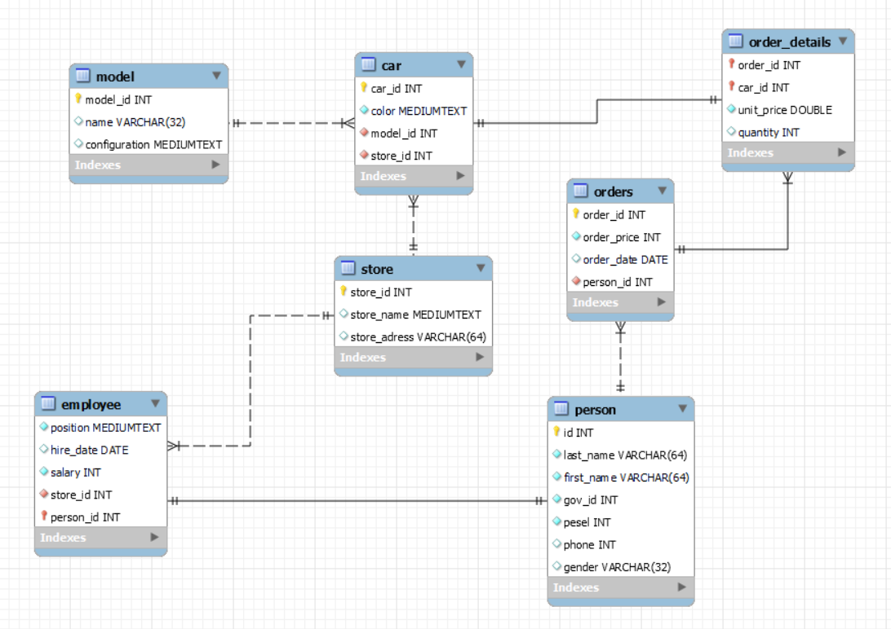

# Car-Shop Database

---
### Description

The database represents a small car reseller point.

---

### Tables
- Employee ( represents each employee in each store, extends person table )
- Store ( Available stores )
- Model (specifications of each car (manufacturer - model, configuration ) )
- Person (any person, either customer or employee)
- Orders (completed orders)
- Car (cars that are being sold)

---
### The repository includes
- Database creation sql script.
- .mwb entity relationship diagram file

---
## Relational Diagram

